# LDTS_12:04 - PAC-MANO

In this exciting 16-bit arcade game you can help guide Pac-Mano through a maze to eat Pac-Dots; when all dots are eaten, Pac-Mano is taken to start and you can continue to elevate your highscore. Four ghosts, Blinky, Pinky, Inky and Clyde roam the maze, trying to catch Pac-Mano - if a ghost touches him, a life is lost.
When all lives have been lost, the game ends.
Near the corners of the maze are four larger, flashing dots known as Power Pellets, they provide Pac-Mano with the temporary ability to eat the ghosts. The ghosts turn deep blue, reverse direction, and move slower when Pac-Mano eats one.
When a ghost is eaten, it returns to the ghost home where it is regenerated in its normal color.
Any similarities to the popular game Pac-Man are purely coincidental.

**This project was developed by : **
Diogo Alexandre Oliveira da Silva (up202105327@fe.up.pt); 
José Luís Soares Barbosa da Silva (up201906576@fe.up.pt); 
Tomé Leite da Cunha (up201904710@fe.up.pt) for LDTS 2022/23;
 
 

------

## IMPLEMENTED FEATURES

**Examples**:

- **Menu** - Where you can start or quit game.
- **Main character** - Pac-Mano.
- **Ghosts** - Blinky , Pinky , Inky and Clyde .
- **Pellets** - 2 types of pellets , normal and power pellet.
- **Lives** -Lives are displayed on the screen and when you die one will disappear until there's no more left, and you loose the game.
- **Map** - Custom map structure implemented.
- **Moving** - The game character will move when the arrow keys are pressed, 
and keep moving until-you find a node where you can change position again ,
or collide with a wall.
- **Pausing** - You can pause the game using "P" key.
- **Freight Mode** - When you eat a power pellet ghosts go into freight mode and become eatable.
- **Score** - When you eat pellets and ghosts your score increases , score added also depends on type of pellets.
- **FPS display in terminal** - When you're playing the game the FPS are displayed in Terminal.#
- **16 bit Rendering** - 16 bit rendering using tiles with 16*16 pixel.
- **Sound Effects** - Sound Effects play at the start of the game and when you eat pellets and ghosts .

**fig.1- GIF**

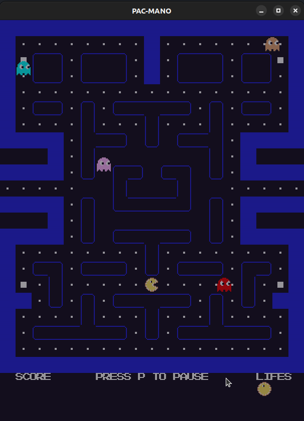

**fig.2- Game Running**

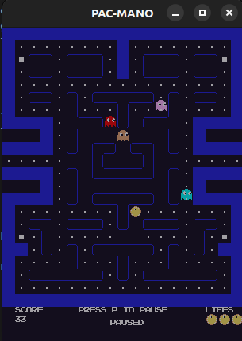

**fig.3- Game Paused**
 
 

------

## DESIGN

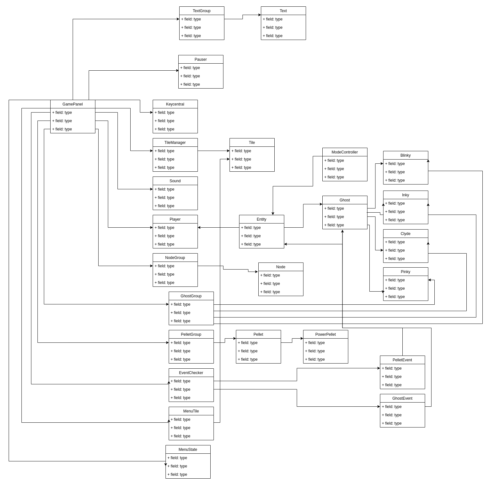

**fig.4- UML**

### UML

### Composite
- **Problem in context** -
 We wanted to be able to monitorize the ghosts as a group , the pellets as a group , and the nodes as a group.

- **The Pattern** - 
So we implemented the Composite design Pattern that lets us compose objects into tree structures and then work with these structures as if they were individual objects.

- **Implementation**
 
 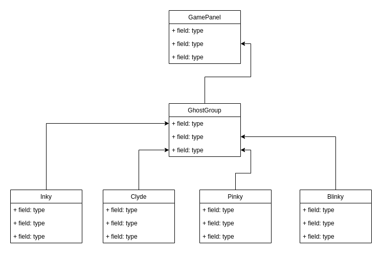
 
 **fig.4- Ghost Group Composite**
 
 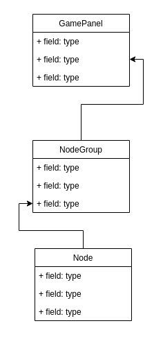
 
 **fig.5- Node Group Composite**
 
 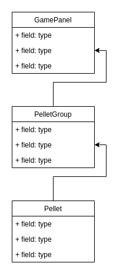
 
 **fig.6- Pellet Group Composite**

- **Consequences** -
This allowed us to have all the nodes to be created and joined at the same time creating a dynamic graph that later allowed us to implement the player and ghost movements. It also enabled us to reset and create all the pelets as a whole but still keep them as an individual so we can delete one without deleting the whole.

### Singleton
- **Problem in context** -
We wanted to create a Gameloop but ensure that only one instance of it exists.

- **The Pattern** - 
So we implemented the Singleton design Pattern that lets us ensure that a class has only one instance, while providing a global access point to this instance.

- **Implementation**
 
 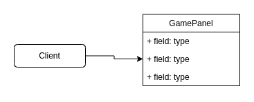
 
 **fig.7- GamePanel Singleton**

- **Consequences** -
This allowed us to have only one Gameloop ,so we don't have duplicated classes that may be created by the GamePanel and cause ingame bugs or duplicated game screens.

### Template

- **Problem in context** -
  We wanted to have different types of entities but also have them have methods in common , we had the same problem with pellets where we wanted to have pellets and powerpellets .

- **The Pattern** -
  So we implemented the Template design Pattern that defines the skeleton of an algorithm in the superclass but lets subclasses override specific steps of the algorithm without changing its structure.

- **Implementation**

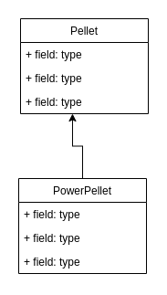

**fig.8- Pellet Template**

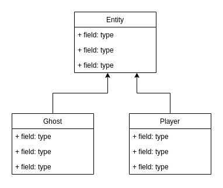

**fig.9- Entity Template**

- **Consequences** -
  This allowed us to have entities based on the same template and different types of pellets based on a pellet template.

### Strategy

- **Problem in context** -
  We wanted to have the three named ghosts act different.

- **The Pattern** -
  So we implemented the Strategy design Pattern that lets us define a family of algorithms, put each of them into a separate class, and make their objects interchangeable.

- **Implementation**

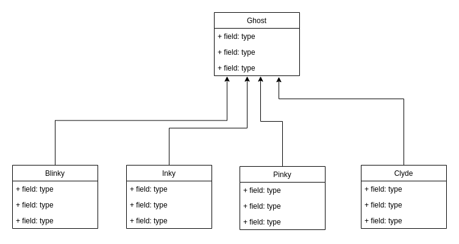

**fig.10- Ghost Strategy**

- **Consequences** -
  This allowed us to have the ghosts act different depending on what ghost they are but still be intrinsically a ghost.

### Observer

- **Problem in context** -
  We wanted to be able to check for collisions with pellets and ghosts without implementing them on the ghost and pellets,
because it would decrease the readability of those classes.

- **The Pattern** -
  So we implemented the Observer design Pattern that lets us define a subscription mechanism to notify multiple objects about any events that happen to the object they’re observing.

- **Implementation**

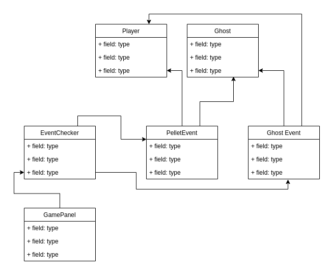

**fig.11- Event Observer**

- **Consequences** -
  This allowed us to detect player collisions with player and pellets , without implementing them on the player class and adjusting any necessary variables accordingly.

------

#### KNOWN CODE SMELLS AND REFACTORING SUGGESTIONS

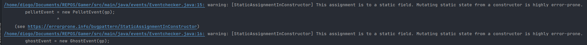

**fig.11- Event Observer**

We couldn´t fix these issues , because our code depended on them since the beginning . So if we had to do something different we would have coded while using error prone , so we could fix
stuff right away and so the code dependencies don't build up on bad code.

------

### TESTING

#### Screenshot of coverage report.
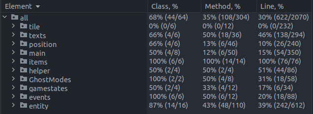
#### Link to mutation testing report.
http://localhost:63342/Gamer/info/pitest/202212232213/index.html?_ijt=m287bn9dnchh59ia3tq535v6ep&_ij_reload=RELOAD_ON_SAVE
### SELF-EVALUATION

- Diogo Alexandre Oliveira da Silva: 40%
- José Luís Soares Barbosa da Silva: 30%
- Tomé Leite da Cunha: 30%

